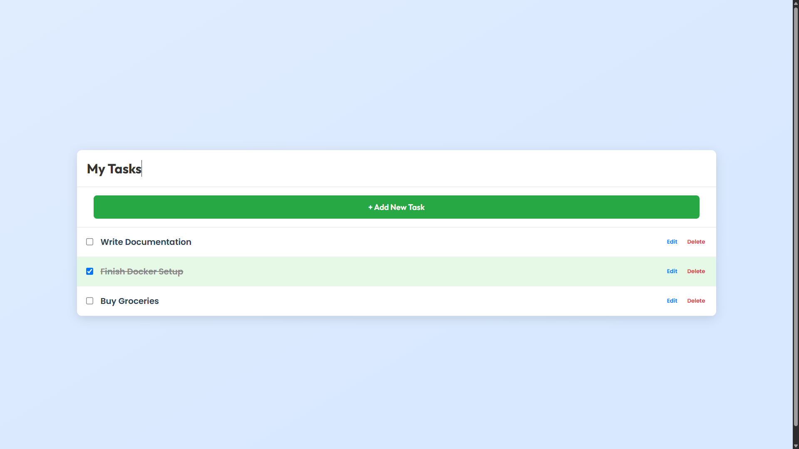

# 📝 Django To-Do List Microservice with Kubernetes

This repository contains the source code and configuration files for deploying a **Django-based To-Do List API** as a containerized application on **Kubernetes (Minikube)**.

## 🔧 Project Overview

This project demonstrates how to:
- Build a simple RESTful To-Do List API using **Django**.
- Containerize the app using **Docker**.
- Deploy it to a local **Kubernetes cluster (Minikube)**.
- Scale the service and implement monitoring features.

---

## 📁 Repository Structure

```
django-todo-list/
│
├── Dockerfile            # Docker image definition
├── README.md             # This file
├── requirements.txt      # Python dependencies
├── deployment.yaml       # Kubernetes Deployment manifest
├── service.yaml          # Kubernetes Service manifest
└── todo/                 # Django project root
    ├── app/              # Core logic: models, views, serializers
    ├── todo/             # Settings, URLs
    ├── manage.py         # Django CLI utility
    └── db.sqlite3        # Development SQLite DB
```

---

## 🐳 Docker Build Instructions

### `Dockerfile`
```Dockerfile
# Use official Python image
FROM python:3.10.17-alpine3.21

# Prevent Python from writing .pyc files
ENV PYTHONDONTWRITEBYTECODE=1

# Ensure stdout is unbuffered
ENV PYTHONUNBUFFERED=1

# Set working directory
WORKDIR /app

# Install system dependencies if needed
RUN apk update && \
    apk add --no-cache gcc musl-dev

# Copy requirements first to leverage Docker layer caching
COPY requirements.txt .

# Install Python dependencies
RUN pip install --upgrade pip && \
    pip install -r requirements.txt

# Copy all project files
COPY . .

# Expose the application port
EXPOSE 5000

# Run Django development server
CMD ["python", "todo/manage.py", "runserver", "0.0.0.0:5000", "--noreload"]
```

### Build and Push Image
```bash
# Build Docker image
docker build -t mkhandani13/django-todo-list .

# Test locally (optional)
docker run -p 5000:5000 mkhandani13/django-todo-list

# Push to Docker Hub
docker tag mkhandani13/django-todo-list mkhandani13/django-todo-list
docker push mkhandani13/django-todo-list
```

---

## ☸️ Kubernetes Deployment

The application is deployed using two Kubernetes manifests:

### `deployment.yaml`
```yaml
apiVersion: apps/v1
kind: Deployment
metadata:
  name: todo-app
spec:
  replicas: 2
  selector:
    matchLabels:
      app: todo
  template:
    metadata:
      labels:
        app: todo
    spec:
      containers:
        - name: todo
          image: mkhandani13/django-todo-list
          ports:
            - containerPort: 5000
```

### `service.yaml`
```yaml
apiVersion: v1
kind: Service
metadata:
  name: todo-service
spec:
  selector:
    app: todo
  ports:
    - protocol: TCP
      port: 80
      targetPort: 5000
  type: NodePort
```

### Apply Manifests
```bash
kubectl apply -f deployment.yaml
kubectl apply -f service.yaml
```

---

## 🖼️ Application Screenshots
```

```

---

## 🧪 Running on Minikube

### Start Minikube
```bash
minikube start
```

### Check Pods
```bash
kubectl get pods -A
```

> **Output:**
```
NAMESPACE     NAME                             READY   STATUS    RESTARTS   AGE
default       todo-app-64d59b8784-abcde      1/1     Running   0          10m
default       todo-app-64d59b8784-xyz12      1/1     Running   0          10m
...
```

### Access the App
```bash
minikube service todo-service
```

---

## 📋 Requirements File

### `requirements.txt`
```
asgiref==3.8.1
Django==5.2.1
djangorestframework==3.16.0
sqlparse==0.5.3
tzdata==2025.2
```

---

## 🧪 API Endpoints

| Method | Endpoint        | Description             |
|--------|------------------|--------------------------|
| GET    | `/tasks/`        | Get all tasks            |
| POST   | `/tasks/`        | Create a new task        |
| GET    | `/tasks/{id}/`   | Get task by ID           |
| DELETE | `/tasks/{id}/`   | Delete task by ID        |

---

## ⬆️ Scaling the Application

### Manual Scaling
```bash
kubectl scale deployment todo-app --replicas=3
```

### Horizontal Pod Autoscaler (HPA)
```bash
kubectl autoscale deployment todo-app --cpu-percent=50 --min=2 --max=5
```

---

## 🛠️ Troubleshooting

| Issue | Solution |
|-------|----------|
| Pods not starting | Check logs: `kubectl logs <pod-name>` |
| Image pull errors | Ensure correct image name in deployment |
| Service unreachable | Use `minikube service todo-service` |
| Minikube issues | Restart Minikube: `minikube delete && minikube start` |

---

## 🚀 Future Improvements

- Replace SQLite with PostgreSQL for production readiness.
- Add environment variables using **ConfigMaps** and **Secrets**.
- Implement persistent storage using **Persistent Volume Claims (PVCs)**.
- Set up a CI/CD pipeline using **GitHub Actions**.
- Integrate **Prometheus + Grafana** for monitoring.

---
